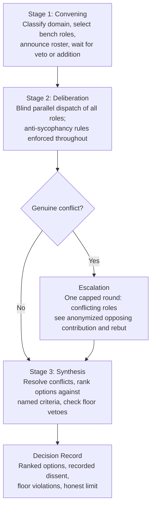

# council

council is a Claude Code skill that convenes a panel of specialist roles to deliberate on any decision, design choice, or open question. It enforces anti-sycophancy rules throughout every deliberation and produces a structured decision record with ranked options, recorded dissent, and any hard vetoes.

## The Council Suite

council is one of three companion Claude Code skills that take a unit of work from decision to shipped. Each works on its own; together they compose.

- **council** (this repo) - convene a panel of specialist roles to deliberate a decision and produce a ranked decision record with recorded dissent and hard vetoes.
- **[cadence](https://github.com/vsruthi00/cadence)** - carry a decision through planning, execution, re-invocation, and a security gate while keeping the context window economical.
- **[ledger](https://github.com/vsruthi00/ledger)** - replace a single growing handoff file with a sharded project-memory library, so each session and subagent loads only the shards it needs.

council decides; cadence drives the resulting work and re-invokes council when something changes; ledger preserves continuity across sessions.

## Why

A single model answering a question tends to agree with the framing of the question. council counters that by dispatching multiple roles in parallel, each loaded in isolation, each required to apply a different analytical lens. Roles that are structurally required to attack a proposal (contrarian, empiricist) must return at least three substantive objections. Hard veto roles (security-redteam, compliance) can block a decision regardless of what the other roles conclude. The synthesis step ranks options against criteria that are fixed before deliberation begins, so the winner is not the option the user appeared to favor.

## How It Works



## Command

```
/council <question>
```

Options:

- `--with <role,role,...>` -- force-add one or more roles beyond those selected by domain classification.
- `--depth deep` -- force an escalation round even when no genuine conflict is detected in the first pass.

## Deliberation Flow

### Stage 1: Convening

The Chairman reads the question, classifies the domain (frontend, backend, database, security/auth, full-stack, ml, or general), and assembles the roster. The six core roles are always present. Bench roles are added per domain. `--with <roles>` force-adds named roles. The Chairman announces the roster and waits for the user to veto or add roles before proceeding.

### Stage 2: Deliberation

The Chairman dispatches every convened role as its own subagent, in parallel, each loaded with only its own files plus applicable overlays. No role sees another role's output during the first pass. After contributions are collected, genuine conflicts (two roles reaching opposed conclusions on the same point) are identified. If conflicts exist, one targeted escalation round runs: the conflicting roles see each other's anonymized contribution and rebut. The escalation round is capped at one. With `--depth deep`, this round runs regardless.

### Anti-Sycophancy (Enforced Throughout)

These are not a separate stage. They are rules applied to every deliberation:

- **Dissent quota:** contrarian and empiricist must each return at least three substantive objections. "Looks good" is not acceptable output from either.
- **Separate generation from judgment:** critical roles attack anonymized content and do not know whose idea it is.
- **Forced steelman:** at least one role must argue the strongest case for the option the user did not favor.
- **Falsifiable claim:** the empiricist must state what observation would prove the recommendation wrong. If nothing could, the recommendation is flagged as faith, not analysis.
- **Score, do not vibe:** the Chairman ranks options against named criteria fixed before deliberation, so the winner is not determined by which option the user appeared to want.
- **Reward the kill:** roles are told that finding a fatal flaw is success, not rudeness.
- **Hard veto floor:** security-redteam and compliance can return NO-GO on a floor violation; the Chairman cannot override it.

**Honest limit:** all roles run on the same model family and read the same prompt. This reduces sycophancy and broadens coverage but does not replace independent models or outside humans. The decision record always states this.

### Stage 3: Synthesis

The Chairman collects all contributions and escalation rebuttals, resolves conflicts by weighting the domain lead specialist more heavily, ranks options against the named criteria, checks for NO-GO floor violations, and emits the decision record.

## Roles

### Core Roles (always convened)

| Role | Model | Mandate |
|---|---|---|
| chairman | Opus | Triage the roster, dispatch role subagents, synthesize contributions, rank options against named criteria, escalate genuine conflicts once, and produce the decision record. |
| first-principles | Opus | Strip the problem to its fundamentals. Discard inherited assumptions and conventions. Rebuild the solution from physical or logical constraints upward. |
| contrarian | Opus | Attack the thesis. Find the single most fatal flaw. Steelman the opposite position. Return ranked failure modes, not politeness. |
| empiricist | Opus | Demand falsifiable claims. Convert opinion and intuition into checkable predictions. Define the cheapest decisive test that would settle the question. |
| executor | Sonnet | Sequence the decision into a concrete plan. Identify the critical path. Name the single next action. Scope down to the smallest shippable unit. |
| outsider | Haiku | Surface the unstated assumptions. Ask the naive question that the room forgot to ask because everyone already knew the answer. Import a perspective from a different field. |

### Bench Roles (added per domain)

| Role | Model | Mandate | Floor |
|---|---|---|---|
| accessibility | Haiku | Audit and enforce accessibility on every interface decision. Return concrete, criterion-referenced findings. Elevate the needs of users who depend on keyboards, screen readers, and assistive technology. | AA on public UI |
| api-contract | Sonnet | Evaluate the design of interfaces between systems: HTTP APIs, GraphQL schemas, RPC contracts, and event payloads. Surface breaking changes, versioning gaps, and contract ambiguities before consumers integrate. | |
| compliance | Sonnet | Audit the design for data privacy and regulatory compliance failures. Surface PII handling violations, unlawful data retention, missing consent, and COPPA exposure before they become legal liability. | NO-GO veto |
| data-db | Opus | Evaluate database design, schema decisions, query patterns, and data integrity choices. Surface normalization failures, missing indexes, unsafe migrations, and consistency model mismatches before they cause data loss or corruption. | |
| data-engineer | Sonnet | Evaluate data pipeline design for correctness, reliability, and maintainability. Surface quality failures, schema evolution risks, non-idempotent jobs, and lineage gaps before they corrupt downstream consumers. | |
| designer-ux | Sonnet | Judge and shape interface clarity and craft. Surface usability failures, hierarchy problems, motion gaps, and accessibility-adjacent design decisions. Return concrete design changes, not vague encouragement. | |
| economist | Sonnet | Evaluate the economic logic of a decision. Surface opportunity cost, total cost of ownership, and the hidden cost of what is not being built. Return a cost-benefit analysis grounded in named economic principles, not intuition. | |
| integration | Sonnet | Evaluate decisions that introduce or rely on third-party services, APIs, and vendors. Surface lock-in risk, reliability gaps, and missing swappability before the integration is built. | |
| maintainer | Sonnet | Evaluate code and design decisions for long-term maintainability. Surface readability failures, structural debt, and naming problems that a new engineer would encounter in a year. | |
| ml-scientist | Opus | Audit machine learning design decisions for scientific validity. Surface data leakage, eval design failures, overfitting risk, and dishonest reporting before they produce a model that looks good in development but fails in production. | |
| ops-sre | Sonnet | Evaluate the operability of a system in production: observability gaps, deployment risk, failure recovery, and on-call burden. Surface what breaks silently, what is hard to roll back, and what leaves engineers without signal when things go wrong. | |
| performance | Sonnet | Find performance bottlenecks in design, architecture, and implementation decisions before they compound. Return a ranked list of concerns with evidence, not assumptions. (Soft budget: flag concerns that exceed reasonable latency or resource thresholds for the project type.) | |
| pre-mortem | Sonnet | Assume the project has already failed. Work backward to the most plausible causes. Surface the risks that optimism, momentum, and sunk-cost thinking conceal. Return a ranked list of failure causes, not reassurance. | |
| security-redteam | Opus | Attack the design for security vulnerabilities. Find exploitable flaws before they ship. Return a ranked threat model with severity ratings and specific remediation steps. Finding a critical flaw is success. | NO-GO veto |
| user-customer | Haiku | Speak only for the person who lives with the result. Surface friction, confusion, and unmet needs from the user's perspective. The elegance of the implementation is irrelevant; what matters is whether the person using this product can accomplish their goal without distress. | |

## Presets and Floors

Three project-level presets let you set the baseline posture for a session. They are stored at `<project>/.council/presets.md` and written by the config helper.

| Preset | Tiers | Default | Floor (cannot be overridden) |
|---|---|---|---|
| security | low / medium / high | medium | No secrets in git, real auth, row-level access |
| accessibility | a / aa / aaa | aa | AA on public UI |
| compliance | off / standard / strict | standard | No PII in logs/client, lawful basis to hold data |

Security-redteam and compliance hold hard NO-GO vetoes that the Chairman cannot override, regardless of the preset tier selected.

## Themes

Council output can be styled with one of six themes. See the interactive preview at [`core/themes/preview.html`](core/themes/preview.html).

| Theme | Best for |
|---|---|
| minimal-light | Dashboards, developer tools, content-dense interfaces |
| warm-editorial | Blogs, education platforms, reading apps |
| modern-dark | Developer tools, technical dashboards, night-mode interfaces |
| soft-pastel | Consumer apps, wellness tools, friendly onboarding flows |
| professional | Business software, fintech, enterprise SaaS, compliance tools |
| natural | Wellness, ecology, sustainability, and lifestyle interfaces |

The active theme is stored at `<project>/.council/theme.md` as a single line: `theme: <name>`. Default is `minimal-light`.

## House Rules and Config

Before running a deliberation on a new project, council may need to know standing house rules, preset floors, and a theme. How config is collected depends on the environment.

**Local environment** (no `REMOTE_SANDBOX`, `CI`, `CODESPACES`, `SSH_CONNECTION`, or `SSH_TTY` set): council offers to open the loopback config helper window. The server binds to 127.0.0.1 on an ephemeral port, serves a browser form, and writes overlay files directly into `<project>/.council/`. The helper server has zero runtime dependencies.

**Remote or headless** (CI, SSH session, cloud sandbox): council uses the in-chat fallback defined in `core/config/chat-fallback.md`. This Q&A flow collects the same information in chat and writes the same files.

Overlay precedence (highest wins):

1. Project overlay: `<project>/.council/house-rules/<role>.md`
2. User-global overlay: `~/.council/house-rules/<role>.md`
3. Baked default: `core/roles/<role>/knowledge.md`

The user never edits files under `core/`. Project and user-global overlays are the correct place for customization. Config schema and valid values are in `core/config/schema.md`.

To run the helper server tests:

```
cd adapters/claude-code/helper-server && npm test
```

## Structure

```
council/
  SKILL.md                     # Claude Code entry point (the skill loads from here)
  core/                        # platform-agnostic: roles, prompts, presets, themes, config
    roles/<role>/role.md       # mandate, output format, model per role
    roles/<role>/knowledge.md  # baked rubric for that role
    prompts/                   # convening, deliberation, anti-sycophancy, synthesis
    presets/                   # security, accessibility, compliance tiers and floors
    themes/                    # six UI theme token files and preview.html
    config/                    # overlay schema, copy, in-chat fallback
  adapters/
    claude-code/
      helper-server/           # loopback config window (Node, zero dependencies)
  README.md
  LICENSE
```

`SKILL.md` is the Claude Code entry point and reads everything it needs from `core/`. The `core/` directory is platform-agnostic; `adapters/` holds only platform-specific extras (here, the optional config helper server).

## Install

1. Clone this repo:

   ```
   git clone git@github.com:vsruthi00/council.git
   ```

2. Make the skill discoverable by Claude Code. Claude Code loads a personal skill from `~/.claude/skills/<name>/SKILL.md`. The entry point `SKILL.md` lives at this repo's root and reads its procedures from `core/`, so symlink the whole repo (keeping it intact) into your skills directory:

   ```
   ln -s "$(pwd)" ~/.claude/skills/council
   ```

   Confirm `council` shows up in your available skills before continuing. (If you prefer not to symlink, copy the repo to `~/.claude/skills/council/` instead.)

3. Invoke the skill:

   ```
   /council should we use a relational or document database for this project?
   /council --with security-redteam is this auth flow safe?
   /council --depth deep which of these two API designs is better?
   ```

## License

PolyForm Perimeter 1.0.0. Free for any use including commercial projects. You may not repackage and sell council itself as a competing product.

Required Notice: Copyright 2026 Sruthi Valluru (https://github.com/vsruthi00)

See [LICENSE](LICENSE) for the full terms.

## Adapters and Other Agents

council is split into a platform-agnostic `core/` directory and per-platform adapters. The Claude Code adapter is the root `SKILL.md` plus the optional helper server under `adapters/claude-code/`. All roles, prompts, presets, themes, and config schema live in `core/` and contain no Claude-specific assumptions.

**Claude Code (available now):** install as above. The root `SKILL.md` is the entry point.

**Cursor, Codex, Gemini (planned):** each will get an adapter under `adapters/<platform>/` that points at the same `core/`. To add one, write that platform's skill or command entry so it dispatches the four `core/prompts/*.md` stages and loads each role from `core/roles/<role>/` in an isolated context, exactly as `SKILL.md` describes. The `core/` directory does not change. These adapters are not built yet; the seam is in place so they are a small addition rather than a rewrite.
